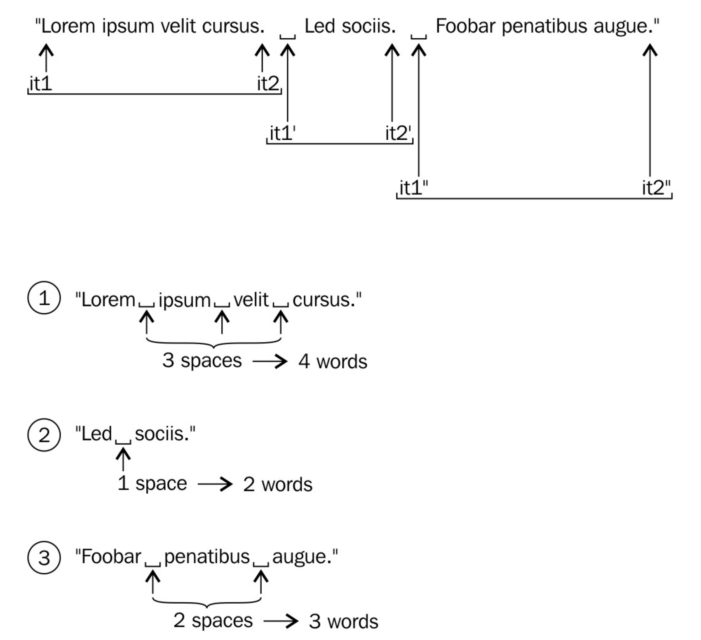

# 实现写作风格助手用来查找文本中很长的句子——std::multimap

当有超级多的元素需要排序时，某些键值描述可能会出现多次，那么使用`std::multimap`完成这项工作无疑是个不错的选择。

先找个应用场景：当使用德文写作时，使用很长的句子是没有问题的。不过，使用英文时，就不行了。我们将实现一个辅助工具来帮助德国作家们分析他们的英文作品，着重于所有句子的长度。为了帮助这些作家改善其写作的文本风格，工具会按句子的长度对每个句子进行分组。这样作家们就能挑出比较长的句子，然后截断这些句子。

## How to do it...

本节中，我们将从标准输入中获取用户输入，用户会输入所有的句子，而非单词。然后，我们将这些句子和其长度收集在`std::multimap`中。之后，我们将对所有句子的长度进行排序，打印给用户看。

1. 包含必要的头文件。`std::multimap`和`std::map`在同一个头文件中声明。

   ```c++
   #include <iostream>
   #include <iterator>
   #include <map>
   #include <algorithm>
   ```

2. 声明所使用的命名空间。

   ```c++
   using namespace std;
   ```

3. 我们使用句号将输入字符串分成若干个句子，句子中的每个单词以空格隔开。句子中的一些对于句子长度无意义的符号，也会计算到长度中，所以，我们在这里要使用辅助函数将这些符号过滤掉。

   ```c++
   string filter_ws(const string &s)
   {
       const char *ws {" \r\n\t"};
       const auto a (s.find_first_not_of(ws));
       const auto b (s.find_last_not_of(ws));
       if (a == string::npos) {
       	return {};
       }
       return s.substr(a, b);
   }
   ```

4. 计算句子长度函数需要接收一个包含相应内容的字符串，并且返回一个`std::multimap`实例，其映射了排序后的句子长度和相应的句子。

   ```c++
   multimap<size_t, string> get_sentence_stats(const string &content)
   {
   ```

5. 这里我们会声明一个`multimap`结构，以及一些迭代器。在计算长度的循环中，我们需要`end`迭代器。然后，我们使用两个迭代器指向文本的开始和结尾。所有句子都在这个文本当中。

   ```c++
       multimap<size_t, string> ret;
       const auto end_it (end(content));
       auto it1 (begin(content));
       auto it2 (find(it1, end_it, '.'));
   ```

6. `it2`总是指向句号，而`it1`指向句子的开头。只要`it1`没有到达文本的末尾就好。第二个条件就是要检查`it2`是否指向字符。如果不满足这些条件，那么就意味着这两个迭代器中没有任何字符了：

   ```c++
   	while (it1 != end_it && distance(it1, it2) > 0) {	
   ```

7. 我们使用两个迭代器间的字符创建一个字符串，并且过滤字符串中所有的空格，只是为了计算句子纯单词的长度。

   ```c++
   		string s {filter_ws({it1, it2})};
   ```

8. 当句子中不包含任何字符，或只有空格时，我们就不统计这句。另外，我们要计算有多少单词在句子中。这很简单，每个单词间都有空格隔开，单词的数量很容易计算。然后，我们就将句子和其长度保存在`multimap`中。

   ```c++
           if (s.length() > 0) {
               const auto words (count(begin(s), end(s), ' ') + 1);
               ret.emplace(make_pair(words, move(s)));
           }
   ```

9. 对于下一次循环迭代，我们将会让`it1`指向`it2`的后一个字符。然后将`it2`指向下一个句号。

   ```c++
           it1 = next(it2, 1);
           it2 = find(it1, end_it, '.');
       } 
   ```

10. 循环结束后，`multimap`包含所有句子以及他们的长度，这里我们将其返回。

    ```c++
    	return ret;
    }
    ```

11. 现在，我们来写主函数。首先，我们让`std::cin`不要跳过空格，因为我们需要句子中有空格。为了读取整个文件，我们使用`std::cin`包装的输入流迭代器初始化一个`std::string`实例。

    ```c++
    int main()
    {
        cin.unsetf(ios::skipws);
        string content {istream_iterator<char>{cin}, {}};
    ```

12. 这里我们只需要打印`multimap`的内容，我们在循环中调用`get_sentence_stats`，然后在循环体中打印`multimap`中的内容。

    ```c++
        for (const auto & [word_count, sentence]
        		: get_sentence_stats(content)) {
       	 cout << word_count << " words: " << sentence << ".\n";
        }
    }
    ```

13. 编译完成后，我们可以使用一个文本文件做例子。由于长句子的输出量很长，所以先把最短的句子打印出来，最后打印最长的句子。这样，我们首先看到最长的句子。

    ```
    $ cat lorem_ipsum.txt | ./sentence_length
    ...
    10 words: Nam quam nunc, blandit vel, luctus pulvinar,
    hendrerit id, lorem.
    10 words: Sed consequat, leo eget bibendum sodales,
    augue velit cursus nunc,.
    12 words: Cum sociis natoque penatibus et magnis dis
    parturient montes, nascetur ridiculus mus.
    17 words: Maecenas tempus, tellus eget condimentum rhoncus,
    sem quam semper libero, sit amet adipiscing sem neque sed ipsum.
    ```

## How it works...

整个例子中，我们将一个很长的字符串，分割成多个短句，从而评估每个句子的长度，并且在`multimap`中进行排序。因为`std::multimap`很容易使用，所以变成较为复杂的部分就在于循环，也就是使用迭代器获取每句话的内容。

```c++
const auto end_it (end(content));

// (1) Beginning of string
auto it1 (begin(content)); 

// (1) First '.' dot
auto it2 (find(it1, end_it, '.')); 
while (it1 != end_it && std::distance(it1, it2) > 0) {
    string sentence {it1, it2};
    // Do something with the sentence string...
    
    // One character past current '.' dot
    it1 = std::next(it2, 1); 
    
    // Next dot, or end of string
    it2 = find(it1, end_it, '.'); 
}
```

将代码和下面的图结合起来可能会更好理解，这里使用具有三句话的字符串来举例。



`it1`和`it2`总是随着字符串向前移动。通过指向句子的开头和结尾的方式，确定一个句子中的内容。`std::find`算法会帮助我们寻找下一个句号的位置。

> std::find的描述：
>
> 从当前位置开始，返回首先找到的目标字符迭代器。如果没有找到，返回结束迭代器。

这样我们就获取了一个句子，然后通过构造对应字符串的方式，将句子的长度计算出来，并将长度和原始句子一起插入`multimap`中。我们使用句子的长度作为元素的键，原句作为值存储在`multimap`中。通常一个文本中，长度相同的句子有很多。这样使用`std::map`就会比较麻烦。不过`std::multimap`就没有重复键值的问题。这些键值也是排序好的，从而能得到用户们想要的输出。

## There's more...

将整个文件读入一个大字符串中后，遍历字符串时需要为每个句子创建副本。这是没有必要的，这里可以使用`std::string_view`来完成这项工作，该类型我们将会放在后面来介绍。

另一种从两个句号中获取句子的方法就是使用`std::regex_iterator`(正则表达式)，我们将会在后面的章节中进行介绍。

