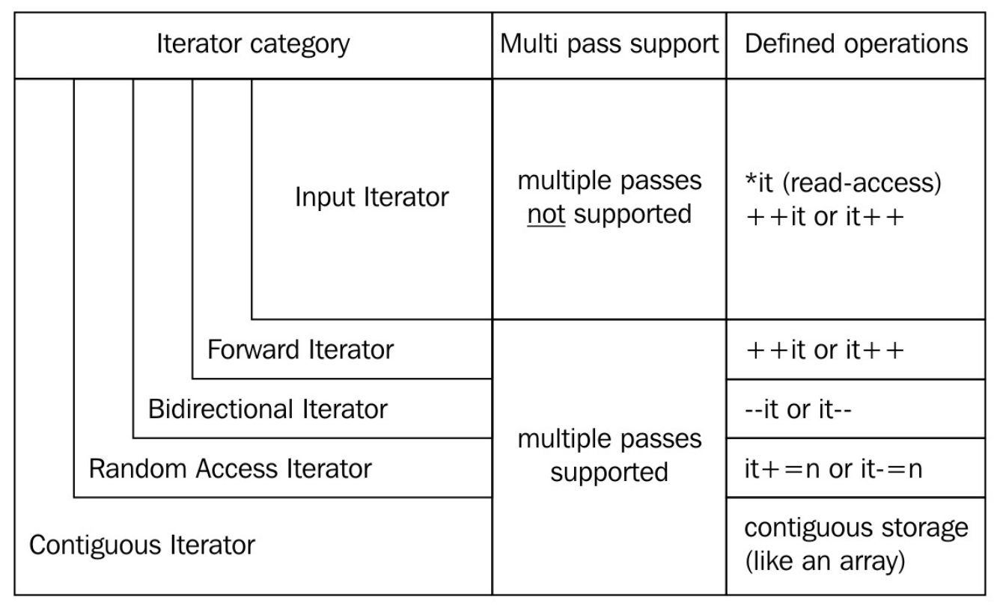

# 第3章 迭代器

迭代器是C++中非常重要的概念之一。STL旨在打造一组灵活和通用的工具集，迭代器是工具集中重要的一环。不过，有时候迭代器使用起来比较繁琐，所以很多编程人员还是喜欢用C的指针来完成相应的功能。一半的编程人员基本上会放弃使用STL中的迭代器。本章介绍了迭代器，并展示如何让它们很快的工作起来。快速介绍是不能完全覆盖迭代器强大的功能，但是这种小巧的例子能让你对迭代器增加很多的好感度。

大多数容器类(除了类似C风格的数组)，可包含一系列的数据项。许多日常任务会处理超大的数据量，这里先不关心如何获得这些数据。不过，如果我们考虑数组和链表，并且想要计算这两种结构所有项的和，那么将如下使用两种不同的算法：

- 通过查询数组的大小，来进行加和计算：

  ```c++
  int sum {0};
  for (size_t i {0}; i < array_size; ++i) { sum += array[i]; }
  ```

- 使用迭代器进行循环，直到数组的末尾：

  ```c++
  int sum {0};
  while (list_node != nullptr) {
  	sum += list_node->value; list_node = list_node->next;
  }
  ```

两种方法都能计算出所有项的加和，不过我们键入的代码，有多少用在实际加和任务中了呢？如果说要使用其他结构体来存储这些数据，例如`std::map`，难道我们还要在重新实现一个函数？使用迭代器是最佳的选择。

通过迭代器的代码才能更加的通用：

```c++
int sum {0};
for (int i : array_or_vector_or_map_or_list) { sum += i; }
```

这段代码很简洁，只是使用C++11添加的for循环范围特性就完成了整体的叠加。其就像是个语法糖，将其扩展后，类似如下代码：

```c++
{
    auto && __range = array_or_vector_or_map_or_list ;
    auto __begin = std::begin(__range);
    auto __end = std::end(__range);
    for ( ; __begin != __end; ++__begin) {
        int i = *__begin;
        sum += i;
    }
}
```

这段代码对于使用迭代器的老手来说并没有什么，不过对于刚接触迭代器的新手来说就像是在变魔术。

假设我们的`vector`内容如下所示：


`std::begin(vector)`和`vector.begin()`等价，并且返回`vector`中指向第一个元素的迭代器(指向1)。`std::end(vector)`与`vector.end()`等价，并返回指向`vector`末尾元素的迭代器(指向5的后方)。

每一次迭代，循环都会检查开始迭代器是否与末尾迭代器不同。如果是，那么可以对开始迭代器进行解引用，并获取其指向的值。然后，推动迭代器指向下一个元素，再与末尾迭代器进行比较，以此类推。这也能提升代码的可读性，这样的迭代器就类似于C风格的指针。实际上，C风格的指针也是一种迭代器。

## 迭代器的类型

C++中很多迭代器类型，都有各自的局限性。不用去死记这些限制，只要记住一种类型的能力是从更强大的类型继承过来的即可。当知道算法是使用何种迭代器实现时，编译器就可以以更好的方式优化这个算法。所以，开发者只要表达清楚自己想要实现的算法，那么编译器将选择优化后的实现来完成对应的任务。

让我们来看下这些迭代器吧(从左往右)：



### 输入迭代器

只能用来读取指向的值。当该迭代器自加时，之前指向的值就不可访问。也就是说，不能使用这个迭代器在一个范围内遍历多次。`std::istream_iterator`就是这样的迭代器。

### 前向迭代器

类似于输入迭代器，不过其可以在指示范围内迭代多次。`std::forward_list`就是这样的迭代器。就像一个单向链表一样，只能向前遍历，不能向后遍历，但可以反复迭代。

### 双向迭代器

从名字就能看出来，这个迭代器可以自增，也可以自减，迭代器可以向前或向后迭代。`std::list`，`std::set`和`std::map`都支持双向迭代器。

### 随机访问迭代器

与其他迭代器不同，随机访问迭代器一次可以跳转到任何容器中的元素上，而非之前的迭代器，一次只能移动一格。`std::vector`和`std::deque`的迭代器就是这种类型。

### 连续迭代器

这种迭代器具有前述几种迭代器的所有特性，不过需要容器内容在内存上是连续的，类似一个数组或`std::vector`。

### 输出迭代器

该迭代器与其他迭代器不同。因为这是一个单纯用于写出的迭代器，其只能增加，并且将对应内容写入文件当中。如果要读取这个迭代中的数据，那么读取到的值就是未定义的。

### 可变迭代器

如果一个迭代器既有输出迭代器的特性，又有其他迭代器的特性，那么这个迭代器就是可变迭代器。该迭代器可读可写。如果我们从一个非常量容器的实例中获取一个迭代器，那么这个迭代器通常都是可变迭代器。


