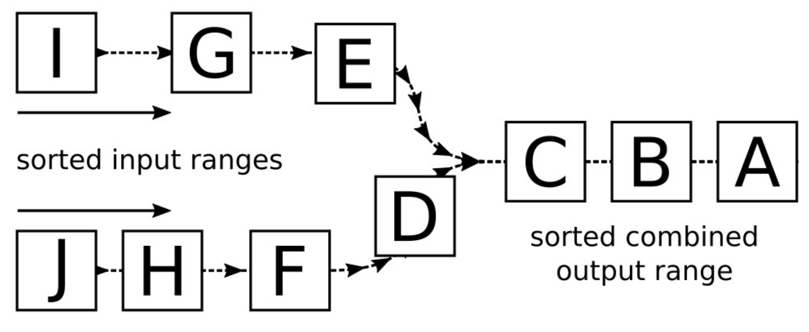

# 实现字典合并工具

假设我们有一个已经排序的列表，有人有另一个已排序的列表，我们想要将这两个列表进行共享。那么最好的方式就是将这两个列表合并起来。我们需要合并后的列表也是有序的，这样我们查找元素就会十分方便。

为了将两个已排序列表中的元素进行合并，我们本能的会想需要创建一个新的列表来放置这两个列表中的元素。对于要加入的元素，我们需要将队列中的元素对比进行，然后找到最小的那个元素将其放到列表的最前面。不过，这样输出队列的顺序会被打乱。下面的图就能很好的说明这个问题：



`std::merge`算法就可以直接来帮助我们做这个事情，这样我们就无需过多的参与。本节我们将展示如何使用这个算法。

## How to do it...

我们将创建一个简单的字典，其为英语单词和德语单词一对一的翻译，之后将其存储在`std::deque`数据结构中。程序将标注输入中获取这个字典，并且打印合并之后的字典。

1. 包含必要的头文件，并声明所使用的命名空间。

   ```c++
   #include <iostream>
   #include <algorithm>
   #include <iterator>
   #include <deque>
   #include <tuple>
   #include <string>
   #include <fstream>
   
   using namespace std; 
   ```

2. 字典是一对字符串，两两对应：

   ```c++
   using dict_entry = pair<string, string>;
   ```

3. 我们将在屏幕上打印这个组对，并且要从用户输入中读取这个组对，所以我们必须要重载`>>`和`<<`操作符：

   ```c++
   namespace std {
   ostream& operator<<(ostream &os, const dict_entry p)
   {
   	return os << p.first << " " << p.second;
   }
   istream& operator>>(istream &is, dict_entry &p)
   {
   	return is >> p.first >> p.second;
   }
   }
   ```

4. 这里需要创建一个辅助函数，其能接受任何流对象作为输入，帮助我们构建字典。其会构建一个`std::deque`来存放一对一的字符串对，并且其会读取标准输入中的所有字符。并在返回字典前，对字典进行排序：

   ```c++
   template <typename IS>
   deque<dict_entry> from_instream(IS &&is)
   {
       deque<dict_entry> d {istream_iterator<dict_entry>{is}, {}};
       sort(begin(d), end(d));
       return d;
   }
   ```

5. 这里我们会使用不同的输入流，创建两个不同的字典。其中一个是从`dict.txt`文件中读取出的字符，我们先假设这个文件存在。其每一行为一个组对。另一个流就是标准输入：

   ```c++
   int main()
   {
       const auto dict1 (from_instream(ifstream{"dict.txt"}));
       const auto dict2 (from_instream(cin));
   ```

6. 作为辅助函数`from_instream`将返回给我们一个已经排过序的字典，这样我们就可以将两个字典直接放入`std::merge`算法中。其能通过给定两个的`begin`和`end`迭代器组确定输入的范围，并在最后给定输出。这里的输出将会打印在用户的屏幕上：

   ```c++
       merge(begin(dict1), end(dict1),
           begin(dict2), end(dict2),
           ostream_iterator<dict_entry>{cout, "\n"});
   }
   ```

7. 我们可以编译这个程序，不过在运行之前，我们需要创建`dict.txt`文件，并且写入如下内容：

   ```c++
   car auto
   cellphone handy
   house haus
   ```

8. 现在我们运行程序了，输入一些英文单词，将其翻译为德文。这时的输出仍旧是一个排序后的字典，其可以将输入的所有单词进行翻译。

   ```c++
   $ echo "table tisch fish fisch dog hund" | ./dictionary_merge
   car auto
   cellphone handy
   dog hund
   fish fisch
   house haus
   table tisch
   ```

## How it works...

`std::meger`算法接受两对`begin/end`迭代器，这两对迭代器确定了输入范围。这两对迭代器所提供的输入范围也必须是已排序的。第五个参数就是输出容器的迭代器，其接受两段范围合并的元素。

其有一个变体`std::inplace_merge`。两个算法几乎一样，不过这个变体只需要一对迭代器，并且没有输出，和其名字一样，其会直接在输入范围上进行操作。比如对`{A, C, B, D}`这个序列来说，我们可以将第一个子序列定义为`{A, C}`，第二个子序列定义为`{B, D}`。使用`std::inplace_merge`算法将两个序列进行合并，其结果为`{A, B, C, D}`。

