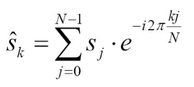
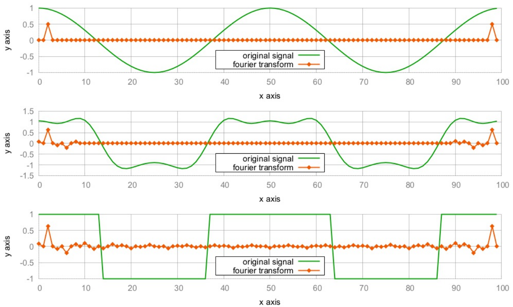

# 使用STL数值算法实现傅里叶变换

信号处理领域傅里叶变换是非常重要和著名的公式。这个公式发现于200年前，不过对于计算机来说，其用例实在太多了。傅里叶变换可以用于音频/图像/视频压缩、音频滤波、医疗图像设备和用于辨识声音的手机引用。

因为其应用领域广泛，STL也试图将其用在数值计算领域。傅里叶变换只是其中一个例子，同样也是非常棘手的一个。其公式如下所示：



其是基于累加和的变换。累加中的每个元素，是输入信号向量中的一个数据点和表达式`exp(-2 * i * ...)`的乘积。这里需要一些工程数学的知识，你需要简单的了解复数的概念，如果你没有相关的知识，了解概念就可以了。仔细观察这个公式，其就是将信号中的所有数据点进行加和(信号数据的长度为N)，其循环索引值为j。其中k是另一个循环变量，因为傅里叶变换计算出的是一组值。在这组值中，每一个数据点都表示着一段重复波形的幅值和相位，这些信息不包含在原始数据中。当我们使用循环对其进行实现，我们的代码可能就会写成下面这样：

```c++
csignal fourier_transform(const csignal &s) {
    csignal t(s.size());
    const double pol {-2.0 * M_PI / s.size()};
    for (size_t k {0}; k < s.size(); ++k) {
        for (size_t j {0}; j < s.size(); ++j) {
            t[k] += s[j] * polar(1.0, pol * k * j);
        }
    }
    return t;
}
```

这里csignal的类型可能是std::vector，其每个元素都是一个复数。对于复数而言，STL中已经有了对应的数据结构可以对其进行表示——std::complex。std::polar函数计算得是`exp(-2 * i * ...)`部分。

这样实现看起来也挺好，不过本节中我们将使用STL工具对其进行实现。

## How to do it...

本节，我们将实现傅里叶变换和逆变换，然后我们会对一些信号进行转换：

1. 首先，包含必要的头文件和声明所使用的命名空间：

   ```c++
   #include <iostream>
   #include <complex>
   #include <vector>
   #include <algorithm>
   #include <iterator>
   #include <numeric>
   #include <valarray>
   #include <cmath>
   
   using namespace std;
   ```

2. 信号点的值一个复数，我们使用std::complex来表示，并使用double进行特化。我们可以对类型进行别名操作，使用cmple表示两个double值，这两个double值分别表示复数的实部和虚部。使用csdignal来别名相应的vector对象：

   ```c++
   using cmplx = complex<double>;
   using csignal = vector<cmplx>;
   ```

3. 我们需要使用数值指针遍历数值序列。公式中的变量k和j就会随着序列进行累加：

   ```c++
   class num_iterator {
   	size_t i;
   public:
   	explicit num_iterator(size_t position) : i{position} {}
       
   	size_t operator*() const { return i; }
       
   	num_iterator& operator++() {
   		++i;
   		return *this;
   	}
       
   	bool operator!=(const num_iterator &other) const {
   		return i != other.i;
   	}
   };
   ```

4. 傅里叶变换需要接收一个信号，并返回一个新的信号。返回的信号表示已经经过傅里叶变换的信号。通过傅里叶逆变换，我们可以将一个经过傅里叶变换的信号，还原成原始信号，这里我们会提供一个可选的bool参数，其会决定变换的方向。bool参数作为参数是一种不好习惯，特别是在一个函数的签名中出现多次。我们这有个很简洁的例子。我们做的第一件事，是使用原始信号的尺寸来分配新的信号数组：

   ```c++
   csignal fourier_transform(const csignal &s, bool back = false)
   {
   	csignal t (s.size());
   ```

5. 公式中有两个因子，其看起来是相同的。让我们将其打包成一个变量：

   ```c++
   	const double pol {2.0 * M_PI * (back ? -1.0 : 1.0)};
   	const double div {back ? 1.0 : double(s.size())};
   ```

6. std::accumulate很适合用来执行公式中的累加部分。我们将对一个范围内的数值使用accumulate。对于每个值，我们将逐步的进行单个相加。std::accumulate算法会调用一个二元函数。该函数的第一个参数为目前为止我们所累加的变量sum，第二个参数为范围内下一个要累加的值。我们会在信号s中对当前为止的值进行查找，并且会将其和复数因子pol相乘。然后，我们返回新的sum。这里的二元函数，使用Lambda表达式进行包装，因为我么将在每次accumulate的调用时，j变量的值是不同的。因为其是二维循环算法，所以内层Lambda做内部的循环，外城Lambda做外层的循环：

   ```c++
       auto sum_up ([=, &s] (size_t j) {
           return [=, &s] (cmplx c, size_t k) {
           	return c + s[k] *
           		polar(1.0, pol * k * j / double(s.size()));
           };
       });
   ```

7. 傅里叶的内部循环，现在使用std::accumulate进行。算法中每个位置，我们都会进行加和。我们使用Lambda表达式来实现，这样我们就能计算出傅里叶变换数组中的每个数据点的值：

   ```c++
   	auto to_ft ([=, &s](size_t j){
           return accumulate(num_iterator{0},
                             num_iterator{s.size()},
                             cmplx{},
                             sum_up(j))
           / div;
       });
   ```

8. 目前位置，我们还没有执行傅里叶变换的代码。我们会准备大量的功能性代码，他们会帮助我们完成很多事情。std::transform的调用将会使j的值在[0, N)间变换(这步是在外层循环完成)。变换之后的值将全部放入t中，t就是我们要返回给用户的值：

   ```c++
       transform(num_iterator{0}, num_iterator{s.size()},
       		 begin(t), to_ft);
       return t;
   }
   ```

9. 我们将会实现一些辅助函数帮助我们生成信号。首先实现的是一个余弦信号生成器。其会返回一个Lambda表达式，这个表达式通过传入的长度参数，产生对应长度的余弦信号数据。信号本身的长度是不固定的，但是其有固定的周期。周期为N，意味着该信号会在N步之后重复。返回的Lambda表达式不接受任何参数。我们可以重读的对其进行调用，并且每次调用表达式将会返回给我们下一个时间点的信号值：

   ```c++
   static auto gen_cosine (size_t period_len){
       return [period_len, n{0}] () mutable {
       	return cos(double(n++) * 2.0 * M_PI / period_len);
       };
   }
   ```

10. 我们所要生成另一个波形是方波。该波形会在-1和+1两值间震荡，其中不会有其他的值。公式看起来有点复杂，但是其变换非常简单，也就是将值n置为+1或-1，并且其震荡周期为period_len。这里要注意，我们没有使用0对n进行初始化。这样，我们的方波的其实位置就在+1上：

    ```c++
    static auto gen_square_wave (size_t period_len)
    {
        return [period_len, n{period_len*7/4}] () mutable {
        	return ((n++ * 2 / period_len) % 2) * 2 - 1.0;
        };
    }
    ```

11. 产生实际信号可以通过vector和信号生成器联合进行，使用重复调用信号生成器对vector数组进行填充。std::generate就用来完成这个任务的。其接受一组begin/end迭代器组和一个生成函数。对于每个合法的迭代器，都会进行`*it = gen()`。通过将这些代码包装陈搞一个函数，我们可以很容器的生成一个信号数组：

    ```c++
    template <typename F>
    static csignal signal_from_generator(size_t len, F gen)
    {
        csignal r (len);
        generate(begin(r), end(r), gen);
        return r;
    }
    ```

12. 最后，我们需要将信号的结果进行打印。我们可以将数组中的值考别到输出流迭代器中进行输出，不过我们需要先将数据进行变换，因为我们的信号数据都是复数对。这样，我们只需要在意每个点的实部就好；所以，我们可以将数组扔到std::transform中进行变换，然后将实部提取出来：

    ```c++
    static void print_signal (const csignal &s)
    {
        auto real_val ([](cmplx c) { return c.real(); });
        transform(begin(s), end(s),
        		 ostream_iterator<double>{cout, " "}, real_val);
        cout << '\n';
    }
    ```

13. 目前为止，傅里叶公式就已经实现了，不过现在还没有信号进行变换。这个工作我们将在主函数中完成。让我们先来定义信号数据的长度。

    ```c++
    int main()
    {
    	const size_t sig_len {100};
    ```

14. 现在来生成信号数据，转换他们，然后进行打印。首先，生成一个余弦信号和一个方波信号。这两组信号的长度和周期数相同：

    ```c++
        auto cosine (signal_from_generator(sig_len,
            gen_cosine( sig_len / 2)));
    
        auto square_wave (signal_from_generator(sig_len,
            gen_square_wave(sig_len / 2)));
    ```

15. 那么现在有了两个波形信号。为了生成第三个信号，我们对方波信号进行傅里叶变换，并且保存在trans_sqw数组中。方波的傅里叶变换有些特殊，我们在后面会进行介绍。索引从10到(signal_length - 10)都设置为0.0。这部分是触及不到的。经过傅里叶变换之后，原始信号将发生很大的变化。我们将在最后看到结果：

    ```c++
        auto trans_sqw (fourier_transform(square_wave));
    
        fill (next(begin(trans_sqw), 10), prev(end(trans_sqw), 10), 0);
        auto mid (fourier_transform(trans_sqw, true));
    ```

16. 现在，我们有三个信号：余弦、mid和方波。对于每个信号，我们将会打印其原始波形，和傅里叶变换过后的波形。输出将有六条曲线组成：

    ```c++
        print_signal(cosine);
        print_signal(fourier_transform(cosine));
        
        print_signal(mid);
        print_signal(trans_sqw);
        
        print_signal(square_wave);
        print_signal(fourier_transform(square_wave));
    }
    ```

17. 编译并运行程序，在终端上会打印出大量的数据。如果这里使用绘图输出，我们就可以看到如下的结果：

    

## How it works...

这段代码又两个比较难理解的部分。第一个是傅里叶变换本身，另一个是使用可变Lambda表达式生成信号数据。

首先，我们来看一下傅里叶变换。其核心部分在循环中实现(虽然没有在我们实现中这样做，但可以结合代码看下介绍中的公式)，可能会以如下方式实现：

```c++
for (size_t k {0}; k < s.size(); ++k) {
    for (size_t j {0}; j < s.size(); ++j) {
    	t[k] += s[j] * polar(1.0, pol * k * j / double(s.size()));
    }
}
```

基于STL算法std::transform和std::accumulate，我们完成了自己的例子，总结一下就类似如下的伪代码：

```
transform(num_iterator{0}, num_iterator{s.size()}, ...
	accumulate((num_iterator0}, num_iterator{s.size()}, ...
		c + s[k] * polar(1.0, pol * k * j / double(s.size()));
```

和循环相比，结果完全一样。当然，使用STL算法也可以产生不太好的代码。不管怎么样吧，这个实现是不依赖所选用的数据结构。其对于列表也起作用(虽然这没有太大的意义)。另一个好处是，在C++17中STL很容易并行(将在本书的另一个章节进行介绍)，当需要并行的时候，我们就需要对纯循环进行重构和拆分，将其放入指定的线程中(除非使用类似OpenMP这样的并发库，其会自动的将循环进行重构)。

下一个难点是信号生成。让我来看一下另一个gen_cosine:

```c++
static auto gen_cosine (size_t period_len)
{
    return [period_len, n{0}] () mutable {
    	return cos(double(n++) * 2.0 * M_PI / period_len);
    };
}
```

每一个Lambda表达式代表一个函数对象，其会在每次调用时改变自身的状态。其状态包含两个变量period_len和n。变量n会在每次调用时，进行变更。在不同的时间点上，得到的是不同的信号值，并且在时间增加时会使用`n++`对n的值进行更新。为了获得信号值的数组，我们创建了辅助函数signal_from_generator：

```c++
template <typename F>
static auto signal_from_generator(size_t len, F gen)
{
    csignal r (len);
    generate(begin(r), end(r), gen);
    return r;
}
```

这个函数会通过所选长度创建一个信号vector，并且调用std::generate对数据点进行填充。数组r中的每一个元素，都会调用一个gen函数。gen函数是是一种自修改函数对象，我们使用相同的方式创建了gen_cosine对象。

> Note：
>
> 本节例子中，STL没有让代码更加的优雅。如果将范围库添加入STL(希望在C++20时加入)，那么事情可能就会有改观。