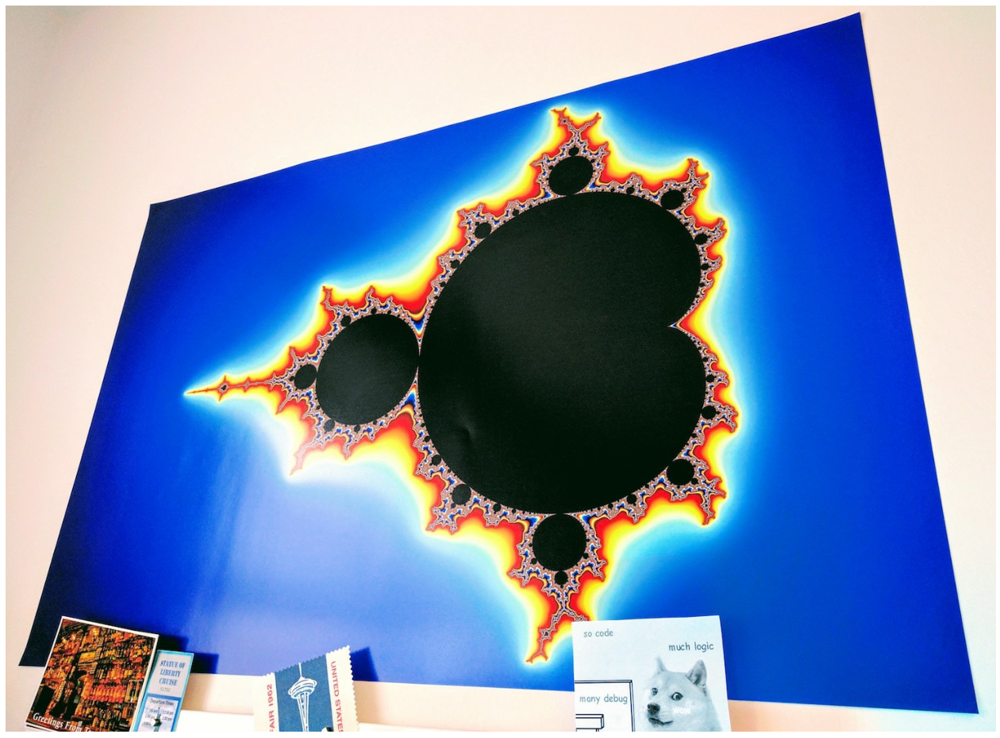

# 使用ASCII字符曼德尔布罗特集合

在1975年，数学家贝诺曼德尔布罗特(Benoit Mandelbrot)创造了一个术语——**分形**。分形是一个数学图像或者集合，这个术语中包含了很多有趣的数学特性，不过最后看起来分形更像是艺术品。分形图像看起来是无限重复的缩小。其中最为众人所知的分形是曼德尔布罗特(Mandelbrot)集合，其集合看起来就像下图一样：



曼德尔布罗特集合可以通过迭代下面的等式得到：


z和c变量都是复数。曼德尔布罗特集合包含等式所覆盖所有让方程收敛的c值。这也就是海报彩色的部分。有有些值收敛的早，有些值收敛的晚，这里用不同的颜色对这些值进行描述，所以我们能在海报中看到各种不同的颜色。对于那些不收敛的值，我们则直接将其所在区域直接涂黑。

使用STL的std::complex类，且不使用循环来实现上面的等式。这并不是炫技，只是为了让大家更容易理解STL相关特性的使用方式。

## How to do it...

本节中，我们将打印类似墙上海报的图，不过这里只是使用ASCII字符将图像打印在终端上：

1. 包含必要的头文件并声明所使用的命名空间：

   ```c++
   #include <iostream>
   #include <algorithm>
   #include <iterator>
   #include <complex>
   #include <numeric>
   #include <vector>
   
   using namespace std;
   ```

2. 曼德尔布罗特集合和之前的等式，都是对复数进行操作。所以，我们需要使用类型别名，使用cmplx来代表std::complex，并特化为double类型：

    ```c++
   using cmplx = complex<double>;
    ```

3. 我们将使用大约20行的代码来完成一个ASCII组成的曼德尔布罗特集合图像，不过我们会将逻辑逐步实现，然后在最后将所有结果进行组合。第一步就是实现一个函数，用于将整型坐标缩放为浮点坐标。这也就是我们如何在屏幕上定位的打印相应的字符。我们想要的是曼德尔布罗特集合中复数的坐标。这样我们就需要实现一个函数，用于将对应的坐标转换成相应的几何图形。用一个Lambda表达式来构建这些变量，并将其返回。该函数能将int类型的函数转换成一个double类型的函数：

   ```c++
   static auto scaler(int min_from, int max_from,
   double min_to, double max_to)
   {
       const int w_from {max_from - min_from};
       const double w_to {max_to - min_to};
       const int mid_from {(max_from - min_from) / 2 + min_from};
       const double mid_to {(max_to - min_to) / 2.0 + min_to};
       
       return [=] (int from) {
      		return double(from - mid_from) / w_from * w_to + mid_to;
       };
   }
   ```

4. 现在我们需要在一个维度上进行坐标变换，不过曼德尔布罗特集合使用的是二维坐标系。为了能将(x, y)坐标系统转换成另一个，我们需要将x-scaler和y-scaler相结合，并且构建一个cmplx实例作为输出：

   ```c++
   template <typename A, typename B>
   static auto scaled_cmplx(A scaler_x, B scaler_y)
   {
       return [=](int x, int y) {
       	return cmplx{scaler_x(x), scaler_y(y)};
       };
   }
   ```

5. 将坐标转换到正确的维度上后，我们就可以来实现曼德尔布罗特方程。我们现在不管怎么打印输出，一心只关注于实现方程。在循环中，对z进行平方，然后加上c，知道abs的值小于2。对于一些坐标来说，其值永远不可能比2小，所以当循环次数达到 max_iterations时，我们就决定放弃。最后，我们将会返回那些abs值收敛的迭代次数：

   ```c++
   static auto mandelbrot_iterations(cmplx c)
   {
       cmplx z {};
       size_t iterations {0};
       const size_t max_iterations {1000};
       while (abs(z) < 2 && iterations < max_iterations) {
           ++iterations;
           z = pow(z, 2) + c;
       }
       return iterations;
   }
   ```

6. 那么现在我们就来实现主函数。在主函数中我们会定义缩放函数对象scale，用于对坐标值进行多维变换：

   ```c++
   int main()
   {
       const size_t w {100};
       const size_t h {40};
       
       auto scale (scaled_cmplx(
           scaler(0, w, -2.0, 1.0),
           scaler(0, h, -1.0, 1.0)
       ));
   ```

7. 为了可以在一维上迭代器整个图形，我们需要完成另一个转换函数，用于将二维图像进行降维操作。其会根据我们所设置的字符宽度进行计算。其会将一维上的长度进行折断，然后进行多行显示，通过使用scale函数对坐标进行变换，然后返回复数坐标：

   ```c++
   	auto i_to_xy ([=](int i) { return scale(i % w, i / w); });
   ```

8. 我们将图像的二维坐标(int，int类型)转换为一维坐标(int类型)，再将坐标转换成曼德尔布罗特结合坐标(cmplx类型)。让我们将所有功能放入一个函数，我们将使用一组调用链：

   ```c++
   	auto to_iteration_count ([=](int i) {
   		return mandelbrot_iterations(i_to_xy(i));
   	});
   ```

9. 现在我们可以来设置所有数据。假设我们的结果ASCII图像的字符宽度为w，高度为h。这样就能将结果存储在一个长度为w * h数组中。我们使用std::iota将数值范围进行填充。这些数字可以用来作为我们转换的输入源 ，我们将变换过程包装在to_iteration_count中：

   ```c++
       vector<int> v (w * h);
       iota(begin(v), end(v), 0);
       transform(begin(v), end(v), begin(v), to_iteration_count);
   ```

10. 基本上就是这样。我们现在具有一个v数组，其使用一维坐标进行初始化，不过后来会被曼德尔布罗特迭代计数所覆盖。因此，我们就可以对图像进行打印。我们可以将终端窗口设置为w个字符宽度，这样我们就不需要打印换行符。不过，我们我们可能会有对std::accumulate有一种创造性的误用。std::accumulate使用二元函数对处理范围进行缩小。我们可以对其提供一个二元函数，其能接受一个输出迭代器(并且我们将在下一步进行终端打印)，并使用范围内的单个值进行计算。如果相应值的迭代次数大于50次时，我们会打印`*`字符到屏幕上。否则，我们则会打印空字符在屏幕上。在每行结束时(因为计数器变量n可被W均匀地分割)，我们会打印一个换行符：

    ```c++
        auto binfunc ([w, n{0}] (auto output_it, int x) mutable {
        	*++output_it = (x > 50 ? '*' : ' ');
        	if (++n % w == 0) { ++output_it = '\n'; }
        	return output_it;
        });
    ```

11. 通过对输入范围使用std::accumulate，我们将二元打印函数和ostream_iterator相结合，我们需要在屏幕上刷新计算出的曼德尔布罗特集合：

    ```c++
    	accumulate(begin(v), end(v), ostream_iterator<char>{cout},
    			  binfunc);
    }
    ```

12. 编译并运行程序，就可以看到如下的输出，其看起来和墙上的海报很像吧！


## How it works...

整个计算过程都使用std::transform对一维数组进行处理：

```c++
vector<int> v (w * h);
iota(begin(v), end(v), 0);
transform(begin(v), end(v), begin(v), to_iteration_count);
```

所以，会发生什么呢？我们为什么要这么做？to_iteration_count函数是基于从i_to_xy开始的调用链，从scale到mandelbrot_iterations。下面的图像就能展示我们的转换步骤：


这样，我们就可以使用一维数组作为输入，并且获得曼德尔布罗特方程的迭代次数(使用一维坐标表示的二维坐标上的值)。三个互不相关的转换是件好事。这样代码就可以独立的进行测试，这样就不用互相牵制了。同样，这样更容易进行正确性测试，并寻找并修复bug。