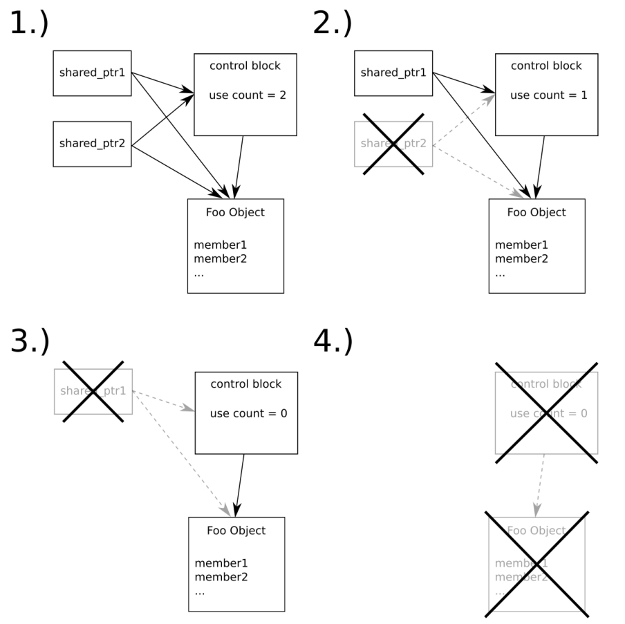

# 处理共享堆内存——std::shared_ptr

上一节中，我们了解了如何使用unique_ptr。这个类型非常有用，因为其能帮助我们管理动态分配的对象。不过，其所有权只能让一个类型对象所有。其不能让多个对象指向同一个动态分配的对象，因为如果这样的话它就不知道要对那个对象进行删除了。

指针类型shared_ptr就是为了应对这种情况所设计的。共享指针可以随时进行拷贝。其内部有一个计数器，记录了有多少对象持有这个指针。只有当最后一个持有者被销毁时，其才会对动态分配的对象进行删除。同样，其也不会让我陷入内存泄漏的窘境，因为对象也会在我们使用之后进行自动删除。同时，我们需要确定对象没有过早的被删除，或是删除的过于频繁(每次对象的创建都要进行一次删除)。

本节中，你将了解到如何使用shared_ptr自动的对动态对象进行管理，并且能在多个所有者间共享动态对象，而后了解其与unique_ptr之间的区别：

## How to do it...

我们将完成一个与unique_ptr节类似的程序，以展示shared_ptr的用法：

1. 包含必要的头文件，并声明所使用的命名空间：

   ```c++
   #include <iostream>
   #include <memory>
   
   using namespace std; 
   ```

2. 然后定义一个辅助类，其能帮助我们了解类何时创建和销毁。我们将会使用shared_ptr对内存进行管理：

   ```c++
   class Foo
   {
   public:
       string name;
       
       Foo(string n)
       	: name{move(n)}
       { cout << "CTOR " << name << '\n'; }
       
       ~Foo() { cout << "DTOR " << name << '\n'; }
   };
   ```

3. 接下来，我们将实现一个函数Foo，其参数的类型为共享指针。接受共享指针作为参数的方式，要比引用有意思的多，因为这样我们不会进行拷贝，但是会改变共享这指针内部的计数器：

   ```c++
   void f(shared_ptr<Foo> sp)
   {
       cout << "f: use counter at "
       	<< sp.use_count() << '\n';
   }
   ```

4. 主函数中，我们声明一个空的共享指针。通过默认构造方式对其进行构造，其实际上是一个null指针：

   ```c++
   int main()
   {
   	shared_ptr<Foo> fa;
   ```

5. 下一步，我么将创建一个代码段，并创建两个Foo对象。我们使用new操作符对第一个对象进行创建，然后使用构造函数在shared_ptr中创建这一对象。我们直接使用`make_shared<Foo>`对第二个实例进行创建，其使用我们提供的参数创建一个Foo实例。这种创建的方式很优雅，我们使用auto类型进行类型推断，这样对象也就算是被第一次访问到。这里与unique_ptr很类似：

   ```c++
   	{
           cout << "Inner scope begin\n";
           
           shared_ptr<Foo> f1 {new Foo{"foo"}};
           auto f2 (make_shared<Foo>("bar"));
   ```

6. 当共享指针被共享时，其需要记录有多少个指针共享这个对象。这需要内部引用计数器或使用独立计数器完成。我们可以使用use_count将这个值进行输出。现在其值为1，因为其还没进行拷贝。我们可以将f1其拷贝给fa，其值将会为2。

   ```c++
   	cout << "f1's use counter at " << f1.use_count() << '\n';
   	fa = f1;
   	cout << "f1's use counter at " << f1.use_count() << '\n';
   ```

7. 在我们离开这个代码段时，共享指针f1和f2将会被销毁。f1变量引用计数将会减少1，现在只有fa拥有这个Foo实例。当符f2被熊回事，其引用计数将减为0。因此，shared_ptr指针将对对象进行销毁：

   ```c++
       }
       cout << "Back to outer scope\n";
       
   	cout << fa.use_count() << '\n';
   ```

8. 现在，让我们用两种方式调用f函数。第一种，我们使用直接考别fa的方式。f函数将会将引用计数输出，其值为2。在第二次对f的调用时，我们将指针移动到函数中。那么现在只有f函数对其指向的对象具有所有权：

   ```c++
   	cout << "first f() call\n";
       f(fa);
       cout << "second f() call\n";
       f(move(fa));
   ```

9. f返回之后，Foo实例就被立即销毁，因为没有任何指针对其有所有权。因此，在主函数返回前，所有对象就都会被销毁：

   ```c++
   	cout << "end of main()\n";
   }
   ```

10. 编译并运行程序就会得到如下输出。起初，我们可以看到foo和bar被创建。然后指针的副本f1出现(其指向foo实例)，其引用计数增加到2。当离开代码段时，因为没有任何指针在对指向bar实例的共享指针具有所有权，所以其会自动进行销毁。现在fa的引用计数为1，因为现在只有fa对foo对象具有所有权。之后，我们调用了两次f函数。第一次调用，我么对fa进行了拷贝，其会再次将引用计数增为2。第二次调用时，我们将fa移动到f中，其对引用计数的数值并无影响。此外，因为f函数具有了foo对象指针的所有权，所以当f函数结束时，foo对象就自动销毁了。这样，在主函数打印出最后一行前，在堆上分配的动态对象就全部被销毁了：

   ```c++
   $ ./shared_ptr
   Inner scope begin
   CTOR foo
   CTOR bar
   f1's use counter at 1
   f1's use counter at 2
   DTOR bar
   Back to outer scope
   1
   first f() call
   f: use counter at 2
   second f() call
   f: use counter at 1
   DTOR foo
   end of main()
   ```

## How it works...

shared_ptr的工作方式与unique_ptr的类似。构造共享指针和唯一指针的方法也非常类似(使用make_shared函数创建共享对象的指针，使用make_unique创建unique_pointer)。

unique_ptr和shared_pointer的最大区别在于可复制性上，这是因为共享指针内部具有一块控制区域(control block)，其中有用来管理对象的指针，还有有一个计数器。当有N个shared_ptr实例指向某个对象时，那么其内部的计数器的值就为N。当shared_ptr实例销毁时，内部计数器会减1。当没有指针对对象具有所有权时，计数器的值即为0，那么对象就会被自动销毁。这样我们就不用担心内存泄漏的事情了。

为了更加形象的说明，我们来看一下下面的图：



第1步中，我们具有两shared_ptr实例用于管理Foo类型的一个对象。所以其引用个数为2。然后，shared_ptr2被销毁，那么计数就会变为1。因为还有指针指相棋实例，所以Foo对象并未被销毁。第3步中，最后一个共享指针也被销毁了。这就导致引用计数为0。第4步会很快在第3步之后发生。所有控制块和Foo实例都会被销毁，并且其内存也会在堆上释放。

了解了shared_ptr和unique_ptr，我们将能很容易的对动态分配的对象进行管理，并且不用担心出现内存泄漏。不过，这里有个忠告——共享指针避免在循环引用的指针间进行，这样会让计数器无法归零，从而导致内存泄漏。

## There's more...

来看一下下面的代码。你能告诉我这段代码是否会发生内存泄漏吗？

```c++
void function(shared_ptr<A>, shared_ptr<B>, int);
// "function" is defined somewhere else

// ...somewhere later in the code:
function(new A{}, new B{}, other_function());
```

你可能会反问我，“怎么可能有内存泄漏呢？”，A和B在分配后就放入shared_ptr类型中，并且其之后会进行释放，所以不会有内存泄漏。

你说的没错，当我们确定shared_ptr实例获取了对应的指针时，那么我们不会遇到内存泄漏。不过这个问题又好像有点琢磨不透。

当我们调用函数f(x(), y(), z())时，编译器需要在f前找到x，y，z函数的定义，并先运行这些函数，然后将其返回值传入f函数中。结合我们上面的例子来说的话，对于编译器来说执行x，y和z函数的顺序并没有被规定。

在回看下我们给出的例子，当编译器决定首先进行`new A{}`的是，操作，然后进行`other_function()`，再进行`new B{}`操作时，那么能确保这些操作的结果会传到function中吗？当`other_function()`抛出一个异常，因为没有使用shared_ptr对A进行管理，所以会造成内存泄漏。无论我们如何捕获这个异常，对这个对象的处理机会已经不在，我们无法将其删除。

这里有两种方法可以规避这个问题：

```c++
// 1.)
function(make_shared<A>(), make_shared<B>(), other_function());

// 2.)
shared_ptr<A> ap {new A{}};
shared_ptr<B> bp {new B{}};
function(ap, bp, other_function());
```

这样，对象在传入函数之前就被shared_ptr所保管，也就无所谓函数是否会在中途抛出异常了。